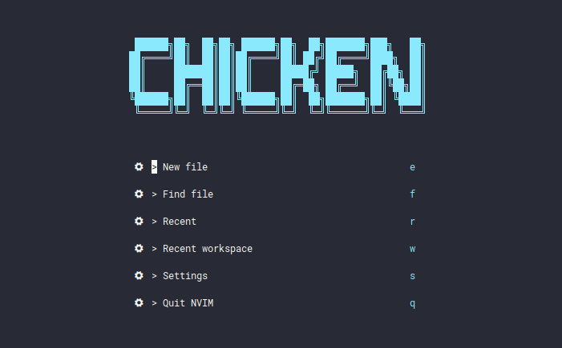
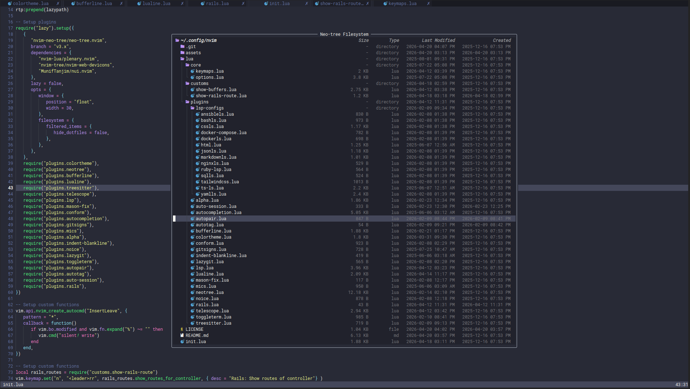
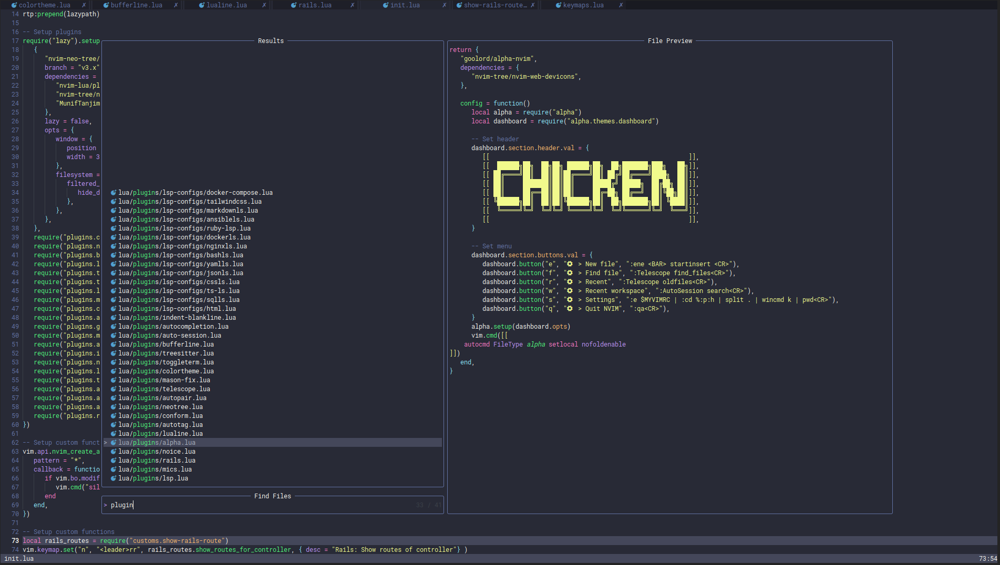

<p align="center">
  
</p>

<p align="center">
  <a href="https://neovim.io/"></a>
  <a href="https://www.lua.org/"></a>
  <a href="https://github.com/folke/lazy.nvim"></a>
  <a href="LICENSE"></a>
</p>

# Neovim configuration (`config-nvim`)

A modular Neovim setup written in Lua, managed with [lazy.nvim](https://github.com/folke/lazy.nvim). It focuses on a fast editing workflow: LSP, Telescope, Neo-tree (floating), Git tooling, formatting with Conform, and a Dracula-based UI—with extra niceties for Ruby on Rails (vim-rails + a custom routes helper).

---

## Preview

| Neo-tree preview | Telescope find file preview |
| :---: | :---: |
|  |  |

---

## Features

- **Plugin management:** lazy.nvim with a lockfile (`lazy-lock.json`).
- **Theme:** [dracula.nvim](https://github.com/Mofiqul/dracula.nvim) (`colorscheme dracula`).
- **LSP & completion:** `nvim-lspconfig`, Mason, `nvim-cmp`, LuaSnip, Fidget.
- **Navigation:** Telescope (with `fzf-native` when `make` is available), `which-key`, vim-tmux-navigator.
- **UI:** alpha-nvim dashboard, bufferline, lualine, neo-tree (float), noice, indent-blankline.
- **Editing:** Treesitter, nvim-autopairs, nvim-ts-autotag, conform.nvim, comment toggles via todo-comments, nvim-colorizer.
- **Git:** gitsigns, vim-fugitive, vim-rhubarb, lazygit.nvim.
- **Sessions:** rmagatti/auto-session (restore last session, autosave).
- **Rails / Ruby:** vim-rails; `<leader>rr` runs a custom helper to show routes for the current controller (`lua/customs/show-rails-route.lua`).
- **Other:** toggleterm, vim-sleuth; **auto-save on `InsertLeave`** when the buffer is modified (see `init.lua`).

Per-language LSP tweaks live under [`lua/plugins/lsp-configs/`](lua/plugins/lsp-configs/) (TypeScript, Tailwind, Ruby LSP, YAML, Docker, Ansible, Bash, Markdown, Nginx, SQL, HTML, JSON, CSS, etc.).

---

## Repository layout

```
init.lua
lua/
  core/
    keymaps.lua      # Global keymaps, diagnostics, format
    options.lua      # Options (clipboard, tabs, folds, …)
  customs/
    show-buffers.lua # Telescope buffer popup (<leader>fb)
    show-rails-route.lua
  plugins/
    *.lua            # Plugin specs & config
    lsp-configs/     # Per-tool LSP settings
lazy-lock.json
assets/              # README images (banner + previews)
```

- **`init.lua`:** Bootstraps lazy.nvim, loads core modules, registers plugins and custom autocmds.
- **`lua/core/`:** Editor options and mappings shared across the config.
- **`lua/plugins/`:** One file per concern (or small groups); LSP overrides in `lsp-configs/`.
- **`lua/customs/`:** Small Lua utilities used from `init.lua` or keymaps.

---

## Requirements

- **Neovim** 0.9+ recommended (uses `vim.lsp` APIs and Lua stdlib).
- A **Nerd Font** in the terminal for icons (web-devicons, bufferline, etc.).
- **Git**, **curl** or system tools as needed for Mason/LSP binaries.
- Optional: **`make`** for building `telescope-fzf-native`; **`lazygit`** on `$PATH` for the LazyGit integration.

---

## Installation

1. **Clone** into your config directory (backup any existing `~/.config/nvim` first):

   ```sh
   git clone https://github.com/chickenHuy/config-nvim.git ~/.config/nvim
   ```

2. **Start Neovim.** lazy.nvim bootstraps and installs plugins on first run.

3. **Mason / LSP tools:** Run `:Mason` to install language servers and formatters you need.

4. **Optional:** Install host tools (Node, Ruby, Python, etc.) required by specific servers—see each file under `lua/plugins/lsp-configs/`.

---

## Usage highlights

| Topic | Keys / notes |
| --- | --- |
| **Neo-tree** | `\` reveal current file; `<leader>nt` toggle float + reveal; `<leader>nb` buffers; `<leader>ng` git status |
| **Telescope** | `<leader>ff` files; `<leader>fg` live grep; `<leader><leader>` buffers; `<leader>f.` recent files; `<leader>/` fuzzy find in buffer |
| **Buffers (BufferLine)** | `<Tab>` / `<S-Tab>` next/prev; `<leader>bd` delete; `<leader>bc` close others; `<leader>bp` / `<leader>bn` cycle |
| **LSP (buffer-local)** | `<leader>gd` definition; `<leader>gi` implementation; `<leader>gD` declaration; `<leader>gt` type def; `<leader>gs` / `<leader>gw` symbols; `<leader>gr` rename; `<leader>ga` code action; `<leader>th` toggle inlay hints |
| **Diagnostics** | `<leader>dp` / `<leader>dn` prev/next; `<leader>dt` float; `<leader>dl` loclist |
| **Format** | `<leader>fm` (Conform) |
| **Git (LazyGit)** | `<leader>lt` open; `<leader>lc` current file; `<leader>lf` / `<leader>lF` filters |
| **Rails** | `<leader>rr` routes for current controller |
| **Custom** | `<leader>fb` buffer picker popup |

Press `<leader>` and pause to see **which-key** hints (leader is **space**).

---

## Customization

- **Plugins:** Add or edit files under [`lua/plugins/`](lua/plugins/).
- **LSP:** Extend [`lua/plugins/lsp.lua`](lua/plugins/lsp.lua) and [`lua/plugins/lsp-configs/`](lua/plugins/lsp-configs/).
- **Keys & options:** [`lua/core/keymaps.lua`](lua/core/keymaps.lua), [`lua/core/options.lua`](lua/core/options.lua).

---

## Updating plugins

Inside Neovim:

```
:Lazy update
```

---

## License

This project is released under the [MIT License](LICENSE). You may use, copy, modify, merge, publish, distribute, sublicense, and/or sell copies of the software, subject to the conditions in that file.

Third-party plugins and tools installed by lazy.nvim or Mason remain under their respective licenses; this license applies to the configuration and Lua files in this repository only.
